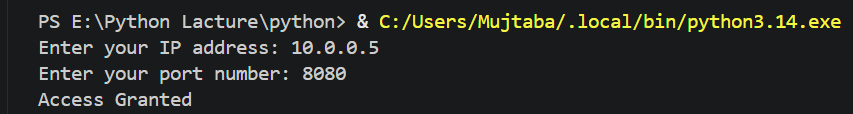
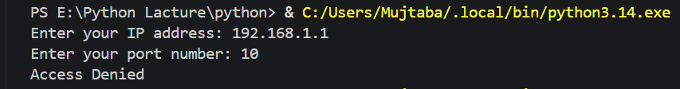
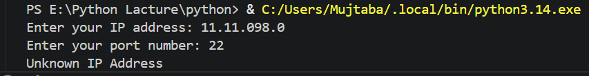

# Firewall Access Control System

> A Python-based firewall simulation built after learning Dictionaries and Sets in Python.

---

## About the Project

This project simulates a real-world **firewall access control system** that checks whether an IP address is authorized and whether the requested port is allowed. Built using Python dictionaries with nested lists and conditional logic, as part of my Dictionaries & Sets practice.

---

## How It Works

| Scenario | Output |
|----------|--------|
| IP exists + Port allowed | Access Granted |
| IP exists + Port not allowed | Access Denied |
| IP not in firewall rules | Unknown IP Address |

---

## Sample Output

**Output 1** — Known IP `10.0.0.5` with allowed port `8080` → Access Granted

---

**Output 2** — Known IP `192.168.1.1` with unauthorized port `10` → Access Denied

---

**Output 3** — Unknown IP `11.11.098.0` → Unknown IP Address

---

## How to Run

1. Make sure Python is installed on your system
2. Clone this repository:
   `git clone https://github.com/ahmad-mujtaba648/firewall-access-control-system.git`
3. Run the file:
   `python firewall.py`

---

## Concepts Practiced

- Dictionaries with nested list values
- `in` operator for key lookup
- Nested conditional statements
- User input handling
- Basic cybersecurity logic

---

## Challenges Faced & Lessons Learned

| Challenge | What I Learned |
|-----------|----------------|
| Checking port inside a list value | Access nested list using `firewall_rules[ip]` |
| `in` operator on dict checks keys only | To check values, access them explicitly |
| Nested data access | Must go step-by-step: outer → inner |
| Avoiding crashes on missing keys | Use `.get()` for safe access |
| Real-world IP/port logic | Firewalls work on exact rule matching |

---

## Tech Stack

---

## Author

**Ahmad Mujtaba**
CS Student @ UET Lahore | Aspiring Cybersecurity & AI Engineer

